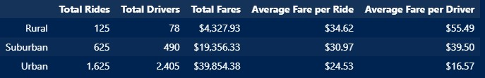

# PyBer_Analysis

# Overview:
The purpose of this project was to look at some data from the company PyBer that operates a ride-sharing application.  The data was split into 3 markets namely the urban, suburban, and rural areas.  Then a statistical analysis was performed and various visualizations created to go with it.

# Results
See the image below for a summary of the results.  From the image it is apparent that the rural routes were the least popular with only 125 rides.  However, they made the most money both per ride and per driver.  Furthermore, the rural routes had the least number of drivers and made the least amount of fares overall.  As one would expect the bulk of the overall fares were from the urban routes.  These routes also had the most drivers.  However, both the average fare per ride and per driver were the lowest among all 3 categories.  Lastly, the suburban market had numbers that fell in between rural and urban.  These results seem to imply that population density has a positive relationship with total ride, total drivers, and total fares and a negative relationship with average fare per ride and per driver.  Further investitation would be warranted.

## Results Image:

# Summary
Based upon the above results the following suggestions may be prudent to increase company profit:
- Increasing the number of drivers in suburban and rural areas perhaps through the use of an incentive program
- Targeted advertising in the suburban and rural areas to attract more riders
- Lastly, the company should increase the amount paid to drivers in urban areas.  These folks are making the least fare per ride and it might help with employee retention and recruitment.
